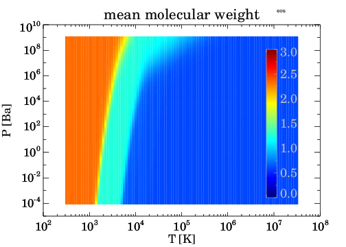
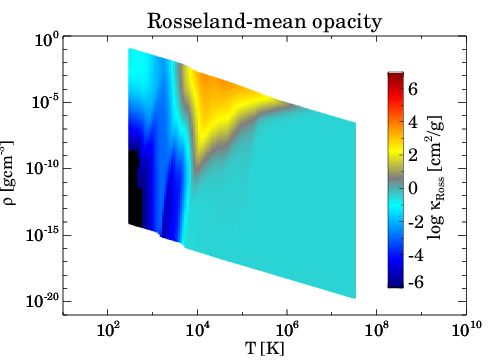
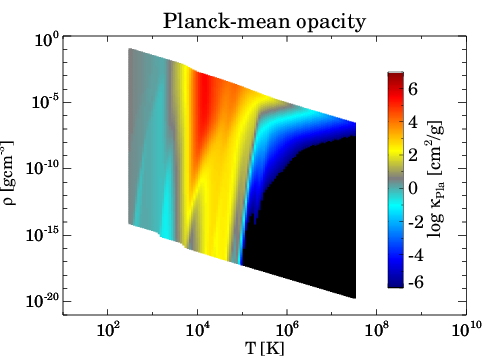
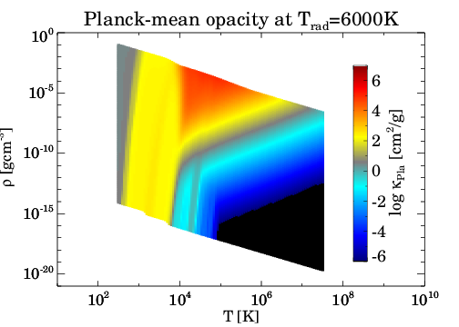
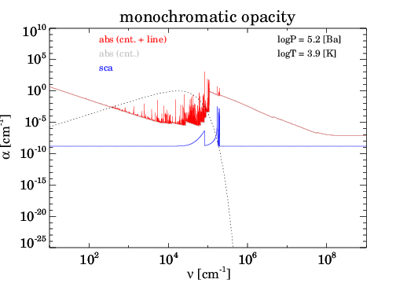

# **`Optab`**
### **Public Fortran90 code package for generating ideal-gas opacity tables**

To execute radiation hydrodynamics simulations, the equation of state and opacity are both critical components. Ideally, these elements should originate from the same set of chemical equilibrium abundances, yet this alignment is not always practiced. `Optab` is designed to calculate opacity based on the chemical equilibrium abundances provided by the user. It outputs both mean and monochromatic opacities, thus enabling the creation of opacity tables that are consistent with the user's equation of state.



### Opacity sources currently implemented
  - Line absorption
    - Atomic lines
      - [Kurucz](http://kurucz.harvard.edu/)
    - Molecular lines
      - [HITRAN](https://hitran.org/)
      - [Exomol](https://www.exomol.com/)
  - Continuum absorption
    - Bremsstrahlung
      - [van Hoof et al. (2014)](https://doi.org/10.1093/mnras/stu1438)
      - [John (1988)](https://ui.adsabs.harvard.edu/abs/1988A&A...193..189J): H<sup>-</sup>
      - [John (1975)](https://doi.org/10.1093/mnras/172.2.305): H<sub>2</sub><sup>-</sup>
    - Photoionization
      - [Verner & Yakovlev (1995)](https://ui.adsabs.harvard.edu/abs/1995A&AS..109..125V)
      - [Verner et al. (1996)](https://ui.adsabs.harvard.edu/abs/1996ApJ...465..487V)
      - [Mathisen's compilation](https://inis.iaea.org/search/search.aspx?orig_q=RN:16033032)
      - [TOPbase](http://cdsweb.u-strasbg.fr/topbase/topbase.html)
      - [Ohmura & Ohmura (1960)](https://doi.org/10.1103/PhysRev.118.154): H<sup>-</sup>
      - [Yan et al. (2001)](https://iopscience.iop.org/article/10.1086/322775): H<sub>2</sub>
    - Collision-induced absorption (EXPERIMENTAL)
      - [HITRAN](https://hitran.org/cia/)
  - Scattering
    - Thomson scattering
    - Rayleigh scattering
      - [Rohrmann & Rueda (2022)](https://doi.org/10.1051/0004-6361/202243883): H
      - [Rohrmann (2017)](https://doi.org/10.1093/mnras/stx2440): He
      - [Tarafdar & Vardya (1973)](https://doi.org/10.1093/mnras/163.3.261): H<sub>2</sub>

## Author
Shigenobu Hirose (JAMSTEC, shirose@jamstec.go.jp)

## Reference
Hirose, S., Hauschildt, P., Minoshima, T., Tomida, K., and Sano, T.
- Astronomy and Astrophysics 659, A87 (2022): https://doi.org/10.1051/0004-6361/202141076 
- arXiv: https://arxiv.org/abs/2112.05689

---
## Quick start guide for `optab`
1. **Build `optab` Executables**
    - Requirements:
      - [GNU Fortran](https://gcc.gnu.org/)
      - [Open MPI](https://www.open-mpi.org/)
      - [HDF5](https://www.hdfgroup.org/solutions/hdf5/)
    - Source directories:
      - `src/`: Contains source codes of `optab`
      - `eos/src/`: Contains source codes for creating HDF5 chemical abundance tables
      - `database/src/`: Contains source codes for generating HDF5 opacity databases
    - Build instructions:\
      Navigate to each source directory and execute make. If necessary, adjust the Makefile to set the paths for Open MPI and HDF5, as well as the Fortran compiler flags. Example Makefile adjustments:
      ```makefile
      OPENMPI = /opt/local
      HDF5 = /opt/local
      FFLAGS = -Wall #-fbounds-check
      ```

1. **Build the `optab` Database**\
  See [`database/README.md`](database/README.md).

1. **Run `optab` Sample**\
  See [`sample/README.md`](sample/README.md).
---
**EOF**
