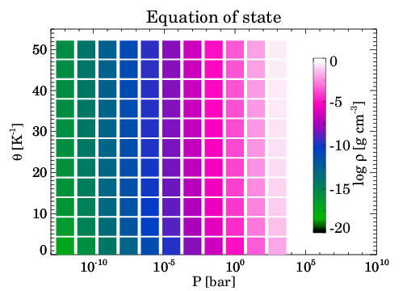
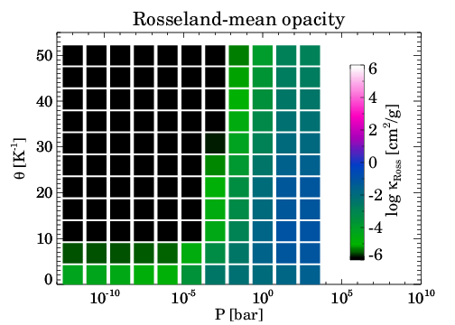
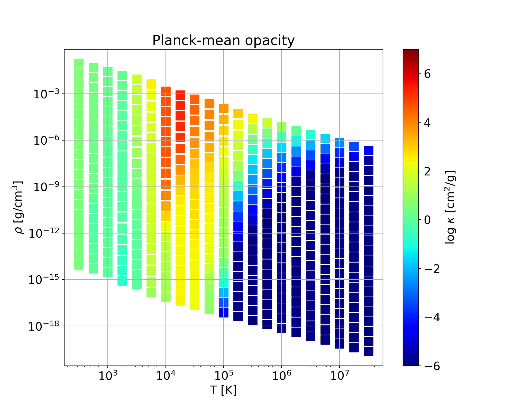
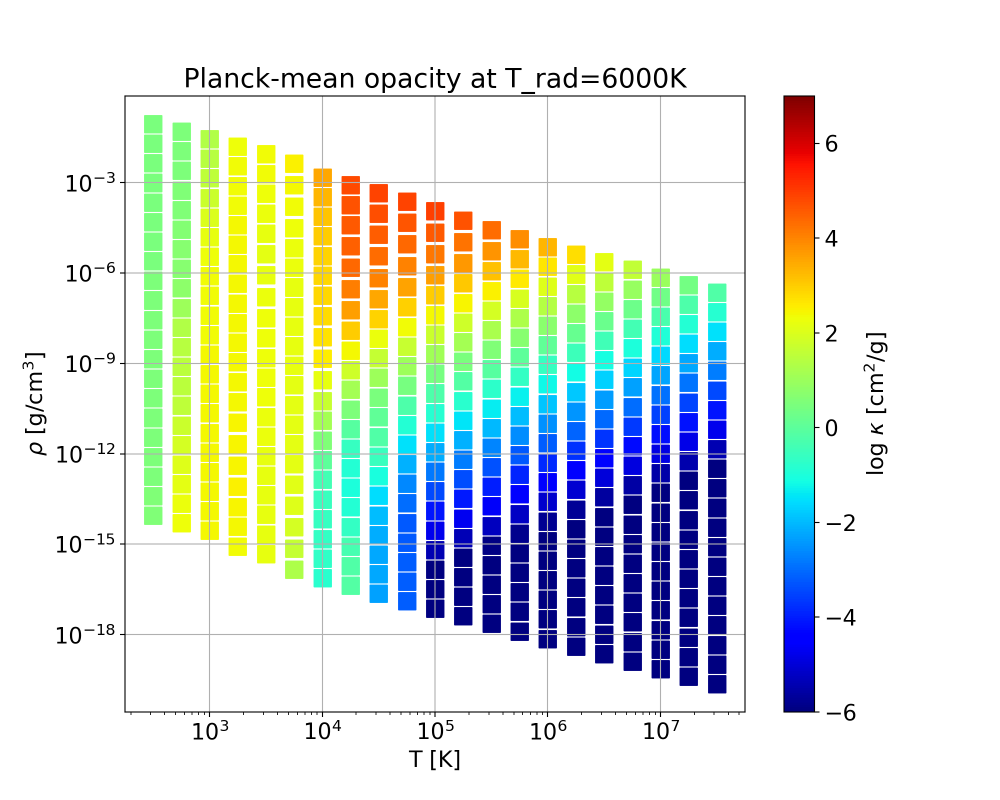
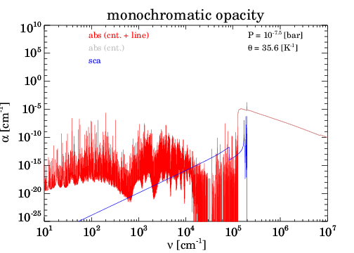

# **`Optab`**
### **Public Fortran90 code package for generating ideal-gas opacity tables**

To perform radiation hydrodynamics simulations, both the equation of state and opacity are necessary. In principle, these two should be derived from the same chemical equilibrium abundances, which often is not the case. `Optab` computes opacity based on user-provided chemical equilibrium abundances, and outputs mean opacities as well as monochromatic opacities. Consequently, one can have opacity tables consistent with one's equation of state.



> In case you don't have your own chemical equilibrium solver, we recommend to use public solvers `FastChem` or `TEA` to compute chemical abundances, for which `Optab` provides interfaces; see an example below.

## Author
Shigenobu Hirose (JAMSTEC, shirose@jamstec.go.jp)

## Reference
Hirose, S., Hauschildt, P., Minoshima, T., Tomida, K., and Sano, T.
- Astronomy and Astrophysics, in press: https://doi.org/10.1051/0004-6361/202141076 
- arXiv: https://arxiv.org/abs/2112.05689

---

## Building `Optab` executables
- Requirements:
  - [GNU Fortran](https://gcc.gnu.org/) (10.3.0)
  - [Open MPI](https://www.open-mpi.org/) (4.1.1)
  - [HDF5](https://www.hdfgroup.org/solutions/hdf5/) (1.12.1)

  You need to have the above softwares (or their equivalents) installed on your system. The numbers in the parentheses are the versions confirmed to work with `Optab` while other versions should also work unless not too old.
- Source directories:
  - `src/`: source codes of `optab`
  - `eos/src/`: source codes for making HDF5 chemical abundance tables read by `optab`
  - `database/src/`: source codes for making HDF5 opacity databases read by `optab`

- Build steps:
  1. Go to each source directory and review `Makefile` for the following variables to modify them if necessary:
      ```makefile
      OPENMPI = /opt/local
      HDF5 = /opt/local
      FFLAGS = -Wall #-fbounds-check
      ```
  2. Type `make` to build the executable(s):
      ```bash
      $ make
      ```

---

## Before you run `Optab`:
1. Build the opacity source database for `Optab`. See [`database/README.md`](database/README.md) for insturction. The opacity sources currently implemented are:
    - Line absorption
      - Atomic lines
        - [Kurucz](http://kurucz.harvard.edu/)
      - Molecular lines
        - [HITRAN](https://hitran.org/)
        - [Exomol](https://www.exomol.com/)
    - Continuum absorption
      - Bremsstrahlung
        - [van Hoof et al. (2014)](https://doi.org/10.1093/mnras/stu1438)
        - [John (1988)](https://ui.adsabs.harvard.edu/abs/1988A&A...193..189J): H<sup>-</sup>
        - [John (1975)](https://doi.org/10.1093/mnras/172.2.305): H<sub>2</sub><sup>-</sup>
      - Photoionization
        - [Verner & Yakovlev (1995)](https://ui.adsabs.harvard.edu/abs/1995A&AS..109..125V)
        - [Verner et al. (1996)](https://ui.adsabs.harvard.edu/abs/1996ApJ...465..487V)
        - [Mathisen's compilation](https://inis.iaea.org/search/search.aspx?orig_q=RN:16033032)
        - [TOPbase](http://cdsweb.u-strasbg.fr/topbase/topbase.html)
        - [Ohmura & Ohmura (1960)](https://doi.org/10.1103/PhysRev.118.154): H<sup>-</sup>
        - [Yan et al. (2001)](https://iopscience.iop.org/article/10.1086/322775): H<sub>2</sub>
      - Collision-induced absorption (EXPERIMENTAL)
        - [HITRAN](https://hitran.org/cia/)
    - Scattering
      - Thomson scattering
      - Rayleigh scattering
        - [Lee (2005)](https://doi.org/10.1111/j.1365-2966.2005.08859.x): H
        - [Rohrmann (2017)](https://doi.org/10.1093/mnras/stx2440): He
        - [Tarafdar & Vardya (1973)](https://doi.org/10.1093/mnras/163.3.261): H<sub>2</sub>

2. Prepare a chemical abundance table that consists of sets of *P* (pressure), *T* (temperature), and *N<sub>i</sub>* (number density of species *i*) like below, and convert it to a specific HDF5 file to be read by `Optab`.

   | P [bar] | T[K] | N<sub>H </sub> [cm<sup>-3</sup>] | N<sub>e</sub> [cm<sup>-3</sup>] | ...  |
   | ---------------- | ---------------- | ---------------- | ---------------- | ---- |
   | 1.0000000000e-12 | 2.5200000000e+03 | 2.6461950252e+06 | 2.9824566824e+02 | ...  |
   | 3.1622776602e-11 | 2.5200000000e+03 | 8.3691983426e+07 | 8.4813733226e+03 | ...  |
   | ...              | ...              | ...              | ...              | ...  |

    The easiest way to do this is to use public chemical equilibrium solvers [`FastChem`](https://github.com/exoclime/FastChem) or [`TEA`](https://github.com/dzesmin/TEA) since `Optab` has conversion codes for their outputs in `eos/src/`. By consulting those codes, it is not difficult to write a conversion code for your own chemical equilibrium solver's output.

---

## Running `Optab` example
Here, we explain how to make opacity tables from a chemical abundance table generated by [`FastChem`](https://github.com/exoclime/FastChem). We assume that you already have `FastChem` ready. Below, `$FASTCHEM` and `$OPTAB` are, respectively, the top directroies of `FastChem` and `Optab`.


1. Run `FastChem` with this [`table.dat`](./work/FastChem/input/table.dat) (input file) and this [`config.input`](./work/FastChem/input/config.input) (configuration file) placed in `$FASTCHEM/input/`. The input file defines the *P* - *T* grid, whose ranges are the same as those in Fig. 5 in [Stock et al. (2018)](https://doi.org/10.1093/mnras/sty1531) and resolution is  11 (in *log P*) times 11 (in *θ = 5040/T*).
    ```bash
    $ cd $FASTCHEM/
    $ ./fastchem ./input/config.input
    ```

2. Convert the `FastChem`'s output file to a specific HDF5 file for `Optab`:
   ```bash
   $ cd $OPTAB/eos/FastChem
   $ ../src/convert_Fastchem $FASTCHEM/output/chem_output_table.dat
   ```
   - The converted HDF5 file `chem_output_table.h5` can be visualized by the IDL code `eos.pro`. You need [TeXtoIDL](http://physics.mnstate.edu/craig/textoidl/) and [Coyote](http://www.idlcoyote.com/index.html) libraries to run the code.

     ```bash
     $ export IDL_PATH=../idl:$PATH_TO_TEXTOIDL:$PATH_TO_COYOTE:"<IDL_DEFAULT>"
     $ idl -e 'eos, "chem_output_table.h5"'
     ```
     

3. Now execute the sample script `table.sh` located in `$OPTAB/sample/` to run `Optab`:
   ```bash
   $ cd $OPTAB/sample/
   $ bash table.sh
   ```
    It takes about 45min on 2.3 GHz 8-Core Intel Core i9 with 8 MPI processes.

    > **NOTE**  
    > Before executing the script, you need to adjust the following four parameters so that they match your environment.
    > - `EOS` : path to the chemical abundance table in the HDF5 format created in the above step
    > - `OPTAB` : path to the top directory of `Optab`
    > - `DATABASE`: path to the top directory of `Optab` database
    > - `MPIBIN`: path to the directory where `mpirun` is installed
    > - `jprc`: number of MPI processes
    
        
    You may also want to review other parameters in the script shown below:		
   ```bash
   ...

   #####
   export EOS='/Users/shirose/optab/eos/FastChem/chem_output_table.h5'
   export OPTAB='/Users/shirose/optab/'
   export DATABASE='/Users/shirose/database/'
   export MPIBIN='/opt/local/bin'
   ...

   ##### SELECT A SINGLE LINE-SOURCE FOR EACH MOLECULAR ISOTOPOLOGUE
   cat <<EOF > input/species_id.dat
   ID   Species   Isotopologue  HITRAN    HITEMP        Exomol		
   1    H2O       1H2-16O       0 HITRAN  1 HITEMP2010  0 POKAZATEL  0 BT2
   1    H2O       1H2-18O       0 HITRAN  1 HITEMP2010  0 HotWat78		
   1    H2O       1H2-17O       0 HITRAN  1 HITEMP2010  0 HotWat78		
   ...
   101  H3+       1H2-2H_p                              0 ST
   999  dummy     dummy         0 dummy
   EOF

   ##### SELECT OPACITY SOURCES TO BE CONSIDERED (1: SELECTED, 0: NOT SELECTED)
   cat <<EOF > input/fort.5
   &switches ! selection of opacity sources
   line_molecules = 1           ! molecular lines
   line_kurucz_gfpred = 1       ! Kurucz gfpred lines
   line_kurucz_gfall = 1        ! Kurucz gfall lines
   rayleigh_scattering_h2 = 1   ! Rayleigh scattering by H2
   rayleigh_scattering_he = 1   ! Rayleigh scattering by He
   rayleigh_scattering_h = 1    ! Rayleigh scattering by H
   electron_scattering = 1      ! electron scattering
   cia = 0                      ! Collision-induced absorption (EXPERIMENTAL)
   photoion_h2 = 1              ! Photoionization by H2
   photoion_topbase = 0         ! TOPbase photoionization
   photoion_mathisen = 1        ! Mathisen photoionization
   photoion_verner = 1          ! Verner photoionization
   photoion_h_minus = 1         ! Photoionization by H-
   brems_h_minus = 1            ! Bremsstrahlung by H-
   brems_h2_minus = 1           ! Bremsstrahlung by H2-
   brems_atomicions = 1         ! Bremsstrahlung by atomic ions
   /
   &cutoffs ! for line evaluation
   cutoff0_voigt = 1d2 ! cutoff for Voigt profile [in wavelenth(cm^-1)]
   cutoff0_gauss = 3d0 ! cutoff for Gaussian profile [in gaussian width]
   delta_crit = 1d-4   ! criteria for discarding weak lines
   delta_voigt = 1d0   ! criteria for adopting Voigt profile
   /
   &radtemp ! radiation temperature for 2-temp Planck-mean opacity
   temp2 = 6000d0
   /
   &grid_log_const ! logarithmic wavenumber grid
   k_total = 100000 ! total number of grid points
   grd_min = 1d0    ! min value of wavenumber grid
   grd_max = 7d0    ! max value of wavenumber grid
   /
   &mpi_decomp ! total number of MPI processes = kprc * jprc * mprc * jprc
   kprc = 1  ! number of processes in wavenumber grid (EXPERIMENTAL)
   lprc = 1  ! number of processes in line loop (EXPERIMENTAL)
   mprc = 1  ! number of processes in reading line-block loop (EXPERIMENTAL)
   jprc = 8  ! number of processes in layer loop
   /
   ...
   EOF

   ...
   ```

4. `Optab` outputs a single HDF5 file for each set of (*T*, *P*, *N*<sub>*i*</sub>), named `mono_?????.h5`, which contains:
   - Rosseland-mean opacity
   - Planck-mean opacity
   - two-temperature Planck-mean opacity
   - monochromatic absorption and scattering opacities

   These quantities can be visualized by the IDL codes `opac.pro` and `mono.pro` in `$OPTAB/sample/` as follows. The fourth command plots monochromatic opacities at layer #80. You need [TeXtoIDL](http://physics.mnstate.edu/craig/textoidl/) and [Coyote](http://www.idlcoyote.com/index.html) libraries to run the codes.
   ```bash
   $ export IDL_PATH=./idl:$PATH_TO_TEXTOIDL:$PATH_TO_COYOTE:"<IDL_DEFAULT>"
   $ idl -e 'opac, dir="table", mean="ross"'
   $ idl -e 'opac, dir="table", mean="pla"'
   $ idl -e 'opac, dir="table", mean="pla2"'
   $ idl -e 'mono, dir="table", layer=80'
   ```
   

---
**EOF**