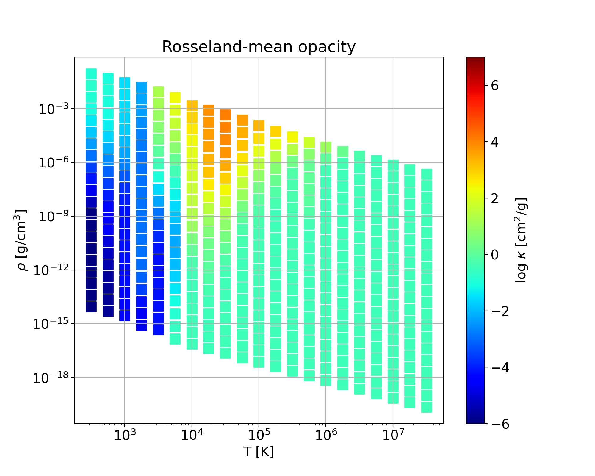
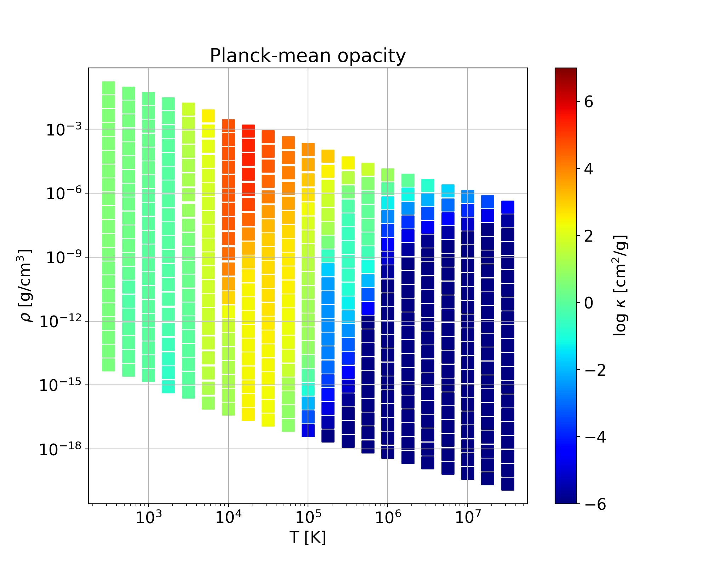
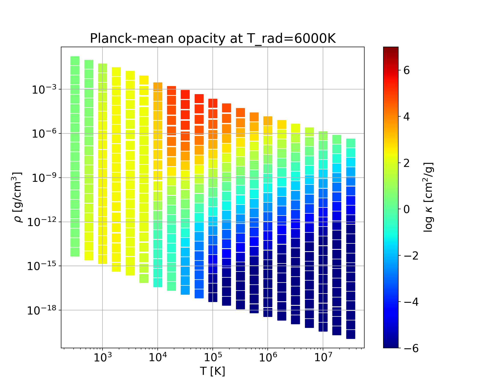
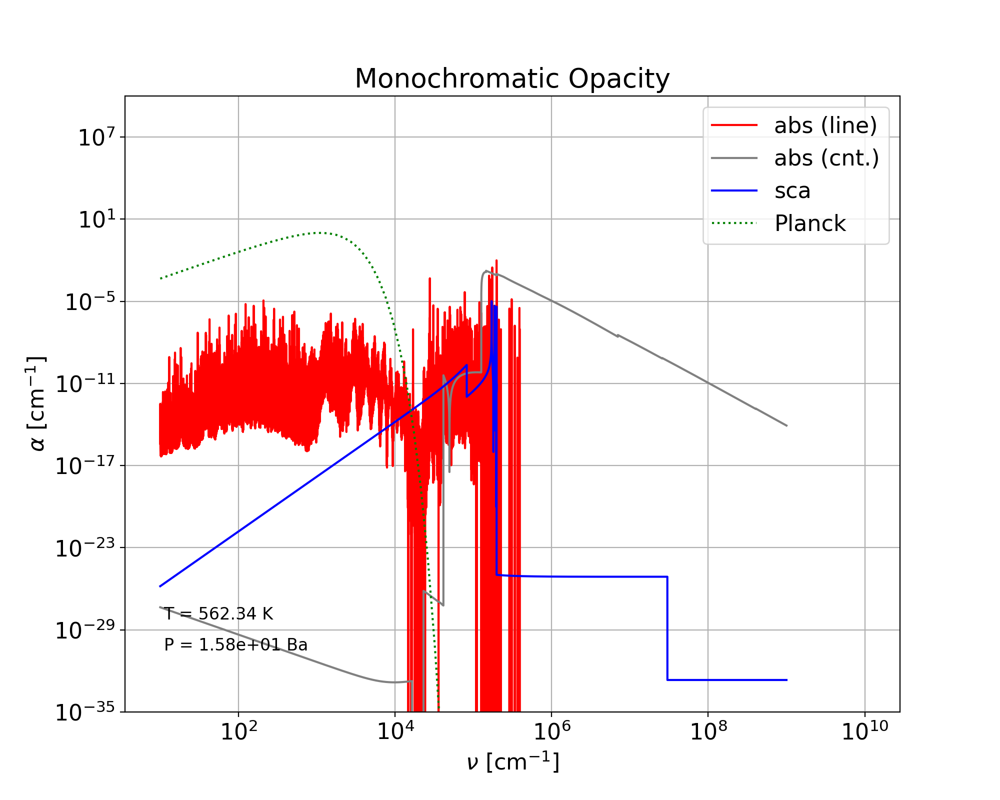
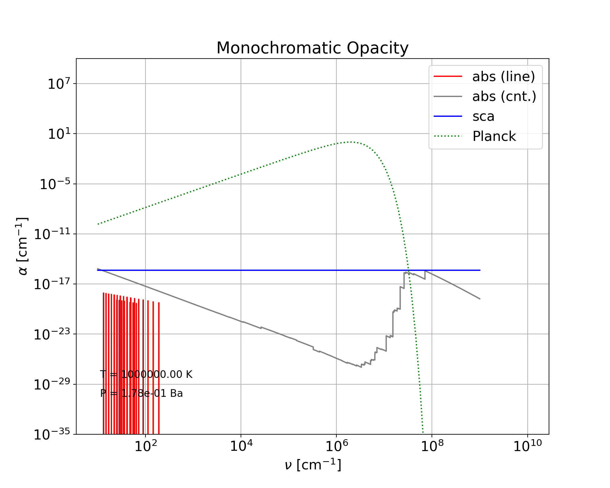

# Running `Optab` example

> ### **CAUTION**
> It is advisable to begin with a minimal number of layers and closely observe the memory consumption before proceeding to full-scale calculations. For instance, in the sample execution below, the peak memory consumption can reach approximately 1.5GB or more, varying with the level of parallelization.

This section details the creation of opacity tables using a chemical abundance table from [`FastChem`](https://github.com/exoclime/FastChem). Ensure `FastChem` is set up before proceeding. The variables `$FASTCHEM` and `$OPTAB` denote the root directories of FastChem and Optab, respectively.

1. **Generate a Chemical Abundance Table with `FastChem`**\
 Follow the instructions in [`work/FastChem-lnk_interpolate_dev/README.md`](../work/FastChem-lnk_interpolate_dev/README.md). By default, the grid is 21 x 21 and evenly spaced in the log T - log P plane (see the image below). (If you plan to use an existing chemical-equilibrium dataset, see [eos/README.md](../eos/README.md).)\
 **Warning:** `FastChem` built with quadruple precision does not run correctly on arm64 Macs due to ABI constraints. arm64 Mac users must run `FastChem` on a separate x86_64 platform; see Step 2 for a fallback.

2. **Convert `FastChem` Output to an `optab`-compatible HDF5 File**
   ```bash
   cd $OPTAB/eos/FastChem
   ../src/convert_Fastchem $FASTCHEM/output/table.dat
   ```
   If you do not have access to an x86_64 platform but still want to test `optab`, a sample `FastChem` output is available at `$OPTAB/work/FastChem-lnk_interpolate_dev/output/table.dat`. In that case, run:
   ```bash
   ../src/convert_Fastchem $OPTAB/work/FastChem-lnk_interpolate_dev/output/table.dat
   ```
   > Visualize the converted HDF5 file table.h5 using the following Python script:
   >  ```bash
   >  python3 ../python/eos.py table.h5 mmw --syms=100
   >  ```
   >  

3. **Execute `optab` with the `sample.sh` Script**
   ```bash
   cd $OPTAB/sample/
   bash sample.sh
   ```
   This example takes approximately 68 minutes on a 3.3 GHz 12-Core Intel Xeon W processor using 12 MPI processes.

    > **NOTE**  
    > Adjust the following parameters to align with your system before running the script:
    > - `EOS` : path to the chemical abundance table in the HDF5 format created in the above step
    > - `OPTAB` : path to the top directory of `Optab`
    > - `DATABASE`: path to the top directory of `Optab` database
    > - `MPIBIN`: path to the directory where `mpirun` is installed
    > - `jprc`: number of MPI processes
        
    Consider reviewing and modifying additional parameters within the script as shown below:		
   ```bash
   ...

   #####
   export EOS='/Volumes/Storage/optab/eos/FastChem/table.h5'
   export OPTAB='/Volumes/Storage/optab/'
   export DATABASE='/Volumes/Storage/optab/database/'
   export MPIBIN='/opt/local/bin'
   ...

   ##### SELECT A SINGLE LINE-SOURCE FOR EACH MOLECULAR ISOTOPOLOGUE
   cat <<EOF > input/species_id.dat
   ID   Species   Isotopologue  HITRAN    HITEMP        Exomol		
   1    H2O       1H2-16O       0 HITRAN  1 HITEMP2010  0 POKAZATEL  0 BT2
   1    H2O       1H2-18O       0 HITRAN  1 HITEMP2010  0 HotWat78		
   1    H2O       1H2-17O       0 HITRAN  1 HITEMP2010  0 HotWat78		
   ...
   101  H3+       1H2-2H_p                              0 ST
   999  dummy     dummy         0 dummy
   EOF

   ##### SELECT OPACITY SOURCES TO BE CONSIDERED (1: SELECTED, 0: NOT SELECTED)
   cat <<EOF > input/fort.5
   &switches ! selection of opacity sources
   line_molecules = 1           ! molecular lines
   line_kurucz_gfpred = 1       ! Kurucz gfpred lines
   line_kurucz_gfall = 1        ! Kurucz gfall lines
   rayleigh_scattering_h2 = 1   ! Rayleigh scattering by H2
   rayleigh_scattering_he = 1   ! Rayleigh scattering by He
   rayleigh_scattering_h = 1    ! Rayleigh scattering by H
   electron_scattering = 1      ! electron scattering
   cia = 0                      ! Collision-induced absorption (EXPERIMENTAL)
   photoion_h2 = 1              ! Photoionization by H2
   photoion_topbase = 0         ! TOPbase photoionization
   photoion_mathisen = 1        ! Mathisen photoionization
   photoion_verner = 1          ! Verner photoionization
   photoion_h_minus = 1         ! Photoionization by H-
   brems_h_minus = 1            ! Bremsstrahlung by H-
   brems_h2_minus = 1           ! Bremsstrahlung by H2-
   brems_atomicions = 1         ! Bremsstrahlung by atomic ions
   /
   &cutoffs ! for line evaluation
   cutoff0_voigt = 1d2 ! cutoff for Voigt profile [in wavelenth(cm^-1)]
   cutoff0_gauss = 3d0 ! cutoff for Gaussian profile [in gaussian width]
   delta_crit = 1d-4   ! criteria for discarding weak lines
   delta_voigt = 1d0   ! criteria for adopting Voigt profile
   /
   &radtemp ! radiation temperature for 2-temp Planck-mean opacity
   temp2 = 6000d0
   /
   &grid_log_const ! logarithmic wavenumber grid
   k_total = 100000 ! total number of grid points
   grd_min = 1d0    ! min value of wavenumber grid
   grd_max = 9d0    ! max value of wavenumber grid
   /
   &mpi_decomp ! total number of MPI processes = kprc * jprc * mprc * jprc
   kprc = 1  ! number of processes in wavenumber grid (EXPERIMENTAL)
   lprc = 1  ! number of processes in line loop (EXPERIMENTAL)
   mprc = 1  ! number of processes in reading line-block loop (EXPERIMENTAL)
   jprc = 12 ! number of processes in layer loop
   /
   ...
   EOF

   ...
   ```

1. **Visualize `optab` Output Files**\
   For each set of (T, P, N<sub>i</sub>), `optab` produces an HDF5 file, `mono_?????.h5` in the directory `$OPTAB/sample/sample/output/`, containing:
   - Rosseland-mean opacity
   - Planck-mean opacity
   - two-temperature Planck-mean opacity
   - monochromatic absorption and scattering opacities

   Use the `opac.py` and `mono.py` scripts within `$OPTAB/sample/python` to visualize the data as follows. To see the available script arguments, execute them without any arguments.
   ```bash
   python3 python/opac.py sample ross 150
   python3 python/opac.py sample pla 150
   python3 python/opac.py sample pla2 150
   python3 python/mono.py sample 30
   python3 python/mono.py sample 300
   ```
   
