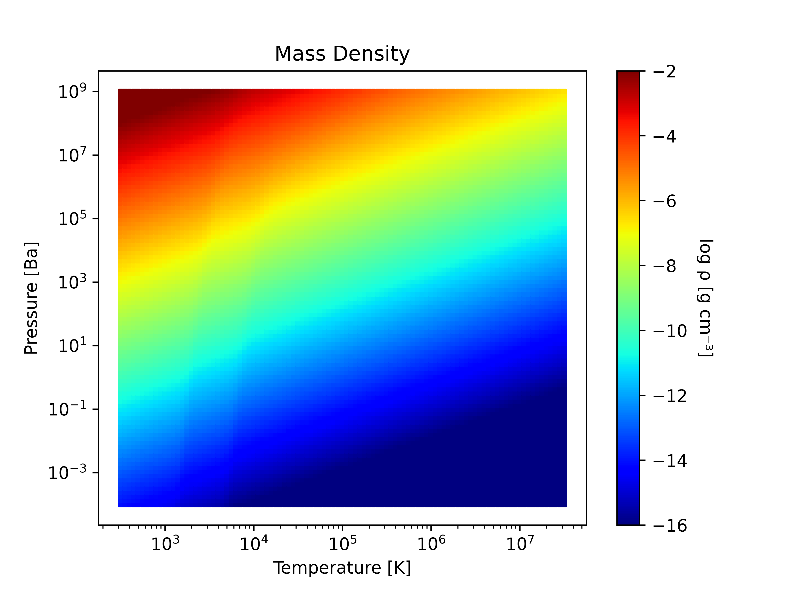
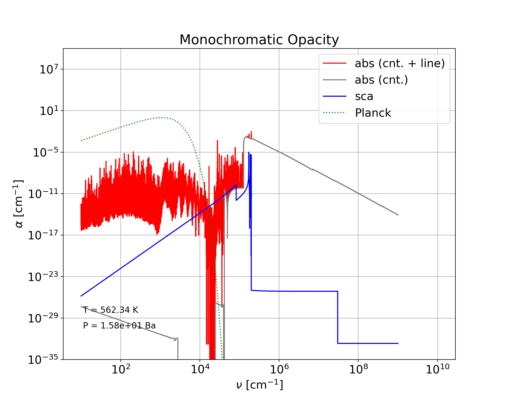

# Running `Optab` example
Here, we explain how to make opacity tables from a chemical abundance table generated by [`FastChem`](https://github.com/exoclime/FastChem). We assume that you already have `FastChem` ready. Below, `$FASTCHEM` and `$OPTAB` are, respectively, the top directroies of `FastChem` and `Optab`.


1. Run `FastChem` to make a chemical abundance table following the instructions described in  [`work/FastChem-lnk_interpolate_dev/README.md`](work/FastChem-lnk_interpolate_dev/README.md). In this example, the grid points are 21 x 21, equally distributed in the log T -- log P plane.

2. Convert the `FastChem`'s output file to a specific HDF5 file for `Optab`:
   ```bash
   cd $OPTAB/eos/FastChem
   ../src/convert_Fastchem $FASTCHEM/output/table.dat
   ```
   - The converted HDF5 file `table.h5` can be visualized by a Python code:

     ```bash
     python3 ../python/eos.py table.h5 mmw --syms=100
     ```
     


3. Now execute the sample script `table.sh` located in `$OPTAB/sample/` to run `Optab`:
   ```bash
   $ cd $OPTAB/sample/
   $ bash table.sh
   ```
   In this example, it takes about 68min on 3.3 GHz 12-Core Intel Xeon W with 12 MPI processes.

    > **NOTE**  
    > Before executing the script, you need to adjust the following four parameters so that they match your environment.
    > - `EOS` : path to the chemical abundance table in the HDF5 format created in the above step
    > - `OPTAB` : path to the top directory of `Optab`
    > - `DATABASE`: path to the top directory of `Optab` database
    > - `MPIBIN`: path to the directory where `mpirun` is installed
    > - `jprc`: number of MPI processes
    
        
    You may also want to review other parameters in the script shown below:		
   ```bash
   ...

   #####
   export EOS='/Users/shirose/Downloads/optab/eos/FastChem/table.h5'
   export OPTAB='/Users/shirose/Downloads/optab/'
   export DATABASE='/Users/shirose/database/'
   export MPIBIN='/opt/local/bin'
   ...

   ##### SELECT A SINGLE LINE-SOURCE FOR EACH MOLECULAR ISOTOPOLOGUE
   cat <<EOF > input/species_id.dat
   ID   Species   Isotopologue  HITRAN    HITEMP        Exomol		
   1    H2O       1H2-16O       0 HITRAN  1 HITEMP2010  0 POKAZATEL  0 BT2
   1    H2O       1H2-18O       0 HITRAN  1 HITEMP2010  0 HotWat78		
   1    H2O       1H2-17O       0 HITRAN  1 HITEMP2010  0 HotWat78		
   ...
   101  H3+       1H2-2H_p                              0 ST
   999  dummy     dummy         0 dummy
   EOF

   ##### SELECT OPACITY SOURCES TO BE CONSIDERED (1: SELECTED, 0: NOT SELECTED)
   cat <<EOF > input/fort.5
   &switches ! selection of opacity sources
   line_molecules = 1           ! molecular lines
   line_kurucz_gfpred = 1       ! Kurucz gfpred lines
   line_kurucz_gfall = 1        ! Kurucz gfall lines
   rayleigh_scattering_h2 = 1   ! Rayleigh scattering by H2
   rayleigh_scattering_he = 1   ! Rayleigh scattering by He
   rayleigh_scattering_h = 1    ! Rayleigh scattering by H
   electron_scattering = 1      ! electron scattering
   cia = 0                      ! Collision-induced absorption (EXPERIMENTAL)
   photoion_h2 = 1              ! Photoionization by H2
   photoion_topbase = 0         ! TOPbase photoionization
   photoion_mathisen = 1        ! Mathisen photoionization
   photoion_verner = 1          ! Verner photoionization
   photoion_h_minus = 1         ! Photoionization by H-
   brems_h_minus = 1            ! Bremsstrahlung by H-
   brems_h2_minus = 1           ! Bremsstrahlung by H2-
   brems_atomicions = 1         ! Bremsstrahlung by atomic ions
   /
   &cutoffs ! for line evaluation
   cutoff0_voigt = 1d2 ! cutoff for Voigt profile [in wavelenth(cm^-1)]
   cutoff0_gauss = 3d0 ! cutoff for Gaussian profile [in gaussian width]
   delta_crit = 1d-4   ! criteria for discarding weak lines
   delta_voigt = 1d0   ! criteria for adopting Voigt profile
   /
   &radtemp ! radiation temperature for 2-temp Planck-mean opacity
   temp2 = 6000d0
   /
   &grid_log_const ! logarithmic wavenumber grid
   k_total = 100000 ! total number of grid points
   grd_min = 1d0    ! min value of wavenumber grid
   grd_max = 9d0    ! max value of wavenumber grid
   /
   &mpi_decomp ! total number of MPI processes = kprc * jprc * mprc * jprc
   kprc = 1  ! number of processes in wavenumber grid (EXPERIMENTAL)
   lprc = 1  ! number of processes in line loop (EXPERIMENTAL)
   mprc = 1  ! number of processes in reading line-block loop (EXPERIMENTAL)
   jprc = 12 ! number of processes in layer loop
   /
   ...
   EOF

   ...
   ```

4. `Optab` outputs a single HDF5 file for each set of (*T*, *P*, *N*<sub>*i*</sub>), named `mono_?????.h5`, which contains:
   - Rosseland-mean opacity
   - Planck-mean opacity
   - two-temperature Planck-mean opacity
   - monochromatic absorption and scattering opacities

  These quantities can be visualized by the Python codes `opac.py` and `mono.py` in `$OPTAB/sample/python` as follows. The fourth command plots monochromatic opacities at layer #30. 
  ```bash
  python3 python/opac.py table ross 150
  python3 python/opac.py table pla 150
  python3 python/opac.py table pla2 150
  python3 python/mono.py table 30
  python3 python/mono.py table 300
  ```
   
